# AIWriteX - 基于CrewAI的智能内容创作平台

[](https://www.python.org/) [](https://pypi.org/project/crewai) [](https://pypi.org/project/aiforge-engine) [](https://pywebview.flowrl.com/) [](https://fastapi.tiangolo.com/) [](https://grapesjs.com/) [](https://microsoft.github.io/monaco-editor/) [](https://marked.js.org/) [](https://github.com/iniwap/PyWinGUIBuilder) [](https://iniwap.github.io/AIWriteX)

  
[<u>AIWriteX</u>](https://aiwritex.voidai.cc/)是基于CrewAI、AIForge的新一代智能内容创作平台，从微信公众号自动化工具起步，正在重新定义AI辅助内容创作的边界，融合"搜索+借鉴+AI+创意"四重能力，多种超绝玩法，让内容创作充满无限可能。  

> **想先看看效果？** 👉 [实例预览](#绝美排版实例预览)  
> **想用商业稳定版？** 👉 [前往官网](https://aiwritex.voidai.cc/)  
> **喜欢这个项目？** ⭐ 点个 Star 支持一下吧！  


## 💎 基本功能
- **自动获取热门话题**：从各大平台实时抓取热门话题，确保文章标题及内容紧跟潮流
- **自动生成与排版**：利用 CrewAI 多角色协作，自动生成文章并完成酷炫排版
  - **💡 实时性文章生成**：采用AIForge多重搜索策略，拒绝过时内容，确保文章时效性
  - **💡 指定话题及参考文章**：支持自定义文章话题、提供参考文章，结合 AI 生成高质量内容
- **自动发布图文**：一键发布图文消息到微信公众号，简化运营流程
- **UI 可视化管理**：提供软件界面，操作简单高效
  - **💡 配置管理**：配置项编辑更加清晰，简单易用
  - **💡 模板管理**：支持模板的各种操作，增删查改等
  - **💡 文章发布管理**：支持文章管理的各种操作、批处理、发布记录以及公众号选择等
  - **💡 配图管理**：支持自定义设置文章的封面、配图等相关操作
- **支持两种运行模式**：
  - **开发模式**：适合技术用户，支持灵活定制开发，适配复杂需求
  - **软件模式**：无需开发环境，安装软件并填写配置即可，适合非技术用户快速体验

## 核心特性：

- 🤖 多智能体协作：基于CrewAI框架的研究员、作家、审核员、设计师团队协作
- 🔍 实时信息融合：集成AIForge引擎，自动获取全网热点与最新资讯
- 🎨 创意内容变换：支持文体转换、时空穿越、角色扮演等多种创意模式
- 📱 全平台发布：支持微信公众号、小红书、抖音、知乎等主流平台（待开发）
- ⚡ 高时效性：融合"搜索+借鉴+AI"，生成实时性强的高质量内容
- 🎯 智能排版：自动生成酷炫排版，适配各平台展示特性

## 🎨 维度化创意变换系统  
  
AIWriteX 独创的**多维度创意变换引擎**，突破传统AI内容创作边界，实现真正的"无限创意组合"！  
  
### ✨ 核心特性  
  
#### 🎯 智能维度选择  
- **自动选择模式**：AI智能分析内容特点，自动选择最适合的维度组合  
- **手动精确控制**：15个维度分类，每个维度10+预设选项，支持自定义输入  
- **兼容性验证**：智能避免冲突维度组合，确保创意效果协调统一  
  
#### 🌟 15大创意维度  
  
**文体表达维度**  
- **文体风格**：诗歌、散文、小说、学术论文、新闻报道等10种风格  
- **语言风格**：古典雅致、现代白话、网络流行、诗意语言等  
- **语调语气**：严肃庄重、轻松随意、幽默诙谐、神秘莫测等  
  
**文化时空维度**    
- **文化视角**：东方哲学、西方思辨、日式物哀、法式浪漫、拉美风情等  
- **时空背景**：春秋战国、唐宋盛世、民国风云、赛博朋克2077等  
- **场景环境**：都市繁华、田园牧歌、科幻未来、古典庭院等  
  
**角色技法维度**  
- **人格角色**：李白、鲁迅、孔子、科学家、艺术家等经典人物  
- **表现技法**：第一人称、意识流、蒙太奇、象征主义等  
- **叙述视角**：全知视角、多视角切换、旁观者视角等  
  
**结构节奏维度**  
- **文章结构**：时间顺序、空间顺序、因果关系、对比对照等  
- **节奏韵律**：快节奏、慢节奏、变化多端、层层递进等  
  
**受众主题维度**  
- **目标受众**：年轻群体、专业人士、旅行爱好者、科技爱好者等  
- **主题内容**：科技反思、环保理念、爱情故事、冒险历程等  
- **情感调性**：治愈系、悬疑惊悚、热血励志、深度哲思等  
  
### 🚀 创意组合示例  
  
**经典组合案例：**  
```yaml  
# 示例1：穿越时空的科技评论  
维度组合：  
  - 人格角色: 李白 (浪漫主义诗人)  
  - 时空背景: 唐宋盛世 (文化繁荣，诗词鼎盛)    
  - 文体风格: 诗歌 (韵律优美，意境深远)  
  - 主题内容: 科技反思 (技术进步，人文关怀)  
效果：用李白的诗意笔触，以唐代视角评论现代AI技术  
  
# 示例2：魔幻现实主义旅行指南   
维度组合：  
  - 文化视角: 拉美风情 (热情奔放，魔幻现实)  
  - 表达格式: 书信体 (情真意切，时光穿越)  
  - 目标受众: 旅行爱好者 (探索世界，体验丰富)  
  - 语言风格: 诗意语言 (韵律优美，意境深远)  
效果：以魔幻现实主义风格，用书信体写给旅行者的城市指南
```
  
**创意流程：**  

```mermaid  
graph LR  
    A[原始话题] --> B[基础内容生成]  
    B --> C[维度化创意引擎]  
    C --> D[智能维度选择]  
    D --> E[AI创意变换]  
    E --> F[最终创意作品]  
      
    C --> G[15个维度分类]  
    G --> H[150+预设选项]  
    H --> I[无限自定义]
```    

### 🎯 使用场景
  
- **内容创作者** - 同一素材，多种风格，丰富内容形式  
- **教育工作者** - 用不同视角解释复杂概念，提升理解效果  
- **营销人员** - 针对不同受众群体，调整内容风格和表达方式  
- **文学爱好者** - 体验跨时代、跨文化的创作乐趣  
  
### ⚙️ 配置示例
  
```yaml  
dimensional_creative:  
  enabled: true                    # 启用创意变换  
  auto_dimension_selection: true   # 自动选择维度  
  max_dimensions: 5               # 最大维度数量  
  creative_intensity: 1.0         # 创意强度（0.7-1.5）  
  preserve_core_info: true        # 保持核心信息  
  compatibility_threshold: 0.6    # 兼容性阈值
```  
  
> **想象一下**：李白用魔幻现实主义的手法，以书信体形式向现代旅行者介绍古代长安城，会是怎样的奇妙体验？这就是 AIWriteX 维度化创意系统的魅力所在！
---

### 更多功能（配置）

通过 `config.yaml` 和 `aiforge.toml` 配置文件，实现高度个性化的功能（推荐使用界面/软件模式编辑配置），以下是关键配置项说明：

- **`config.yaml` 配置项**

| 配置项                     | 说明                                                                         |
|----------------------------|-----------------------------------------------------------------------------|
| **platforms**              | 设置各平台热搜话题随机选取权重，控制选用优先级                                  |
| **wechat**                 | 支持配置多个微信公众号（自动发布时，**必填**`appid`、`appsecret`、`author`）    |
| **wechat.credentials**     | `call_sendall`、`sendall`、`tag_id`用来控制群发情况（仅适用于认证号）          |
| **api**                    | 支持多种大模型平台，**必填**`api_key`                                         |
| **api.api_type**           | 支持多个大模型平台，修改 `api_type` 切换平台，如OpenRouter                     |
| **api.OpenRouter.model_index** | 修改 `model_index` 选择平台内具体模型                                     |
| **api.OpenRouter.model**      | 支持多种模型（如openrouter/deepseek/deepseek-chat-v3-0324:free）          |
| **api.OpenRouter.key_index** | 修改 `key_index` 切换账号（充分利用免费额度，付费账号无需多个）               |
| **api.OpenRouter.api_key** | 支持多个 OpenRouter `api_key`                                               |
| **img_api**                | 图片生成模型，用于公众号封面图                                                |
| **img_api.api_type**       | `ali`（需要填写`api_key`）或`picsum`（随机图片）                              |
| **img_api.picsum**         | 随机图片生成方式，降低生成图片消耗                                             |
| **use_template**           | 是否使用内置模板 ，不使用则AI根据要求直接生成文章HTML                           |
| **template**               | 指定模板文件名（如 `template1`），为空或不存在时随机选择                         |
| **template_category**      | 模板分类，精确匹配话题类型（如健康养生），需分类下存在指定模板                    |
| **use_compress**           | 是否压缩模板上传，降低 token 消耗                                             |
| **aiforge_search_max_results**| AIForge 最大返回搜索结果条数，控制搜索广度                                  |
| **aiforge_search_min_results**| AIForge 最小返回搜索结果条数，越大内容越丰富，但失败率越高                   |
| **min_article_len**        | 生成文章最小字数（默认 1000）                                                 |
| **max_article_len**        | 生成文章最大字数（默认 2000）                                                 |
| **auto_publish**           | 控制自动发布，勾选（true）自动发布，不勾选(false)需手动发布                     |
| **article_format**         | 生成文章格式（HTML、Markdown、txt）,非HTML时，只生成文章，不用模板              |
| **format_publish**         | 当文章格式为Markdown、txt时（微信不支持，直接发布混乱），格式化发布               |

- **`aiforge.toml` 配置项**

| 配置项                     | 说明                                                     |
|----------------------------|---------------------------------------------------------|
| **default_llm_provider**   | 使用模型提供商（默认 OpenRouter），可与 CrewAI 使用的模型不同  |
| **api_key**                | 模型提供商的 API Key（必填）   |
| **其他选填**               | 根据需要配置其他参数（选填），具体参考 UI 界面说明               |

> *1、aiforge.toml详细配置信息，参见[AIForge](https://github.com/iniwap/AIForge)项目主页*  
> *2、通过配置管理界面，可以详细了解关键参数的解释说明（建议运行UI界面模式）*  
> *2、⚠️ 微信公众号AppID/AppSecret、大模型提供商的API KEY是必填项，其他均可默认*  

## 🚀 快速开始

### 软件模式
1. **请下载使用官方正版**：[点击下载](https://aiwritex.voidai.cc/)
2. 打开软件，进行必须要配置（*微信公众号AppID/AppSecret、大模型提供商的API KEY*）
3. 点击`开始执行`

### 开发模式
1. 克隆仓库：
    - `git clone https://github.com/iniwap/AIWriteX.git`
2. 安装依赖：
```shell
pip install uv
uv venv
uv pip install -r requirements.txt
```
3. 配置 `config.yaml`、`aiforge.toml`（*微信公众号AppID/AppSecret、大模型提供商的API KEY*）
4. 运行：
    - 有UI界面：`python .\main.py` (**推荐**)
    - 无UI界面：`python -m src.ai_write_x.crew_main` （**不支持文章、模板、配图管理**）

## 🔍 问题定位

遇到问题时，请根据运行模式查看日志并提交 [Issues](https://github.com/iniwap/AIWriteX/issues)

### 常见问题
请查看`close`(已关闭)的[Issues](https://github.com/iniwap/AIWriteX/issues?q=is%3Aissue%20state%3Aclosed)，以便了解大家常遇到且已经解决的问题。

## 🔮 微信公众号视觉风格设计预览

以下是精心微调、适配并发布的微信公众号模板，涵盖多个话题分类，欢迎预览！

### **绝美排版实例预览**

| 类别       | 风格分类   | 预览链接                     | 示例来源（公众号）                     |
|------------|------------|------------------------------|--------------------------|
|经典案例        | 美食文化  | [点击预览](https://mp.weixin.qq.com/s/-RIunPVHAIni4f4zO51Gvg) | AI夜航员     |
|经典案例        | 涂鸦笔记  | [点击预览](https://mp.weixin.qq.com/s/2_zLwmuY_veug8t7xTxi4w) | AI夜航员     |
|经典案例        | 漫画照片  | [点击预览](https://mp.weixin.qq.com/s/Z7vaed9yQBnD-Hw9JUXYwg) | AI夜航员     |
|经典案例        | 风景杂志  | [点击预览](https://mp.weixin.qq.com/s/z1QFrGToSIvBXJxgcP-vNg) | AI夜航员    |
|经典案例        | 广角摄影  | [点击预览](https://mp.weixin.qq.com/s/kgqcfsP5LZ8zRFv9qe6gDg) | AI夜航员     |
|经典案例        | 电商样片  | [点击预览](https://mp.weixin.qq.com/s/9eyZMDgb0BTtCaa2_LG8Jg) | AI夜航员     |
|经典案例        | ins信息流  | [点击预览](https://mp.weixin.qq.com/s/NjXLavDbdUzMEhmS8qk0rw) | AI夜航员     |
|经典案例        | 视觉杂志  | [点击预览](https://mp.weixin.qq.com/s/Gv0v9SlORXBHdXpcoK1c4w) | AI夜航员    |
|经典案例        | 旅行摄影  | [点击预览](https://mp.weixin.qq.com/s/kWWZ8DuCdxWaPAh3PQHc-Q) | AI夜航员     |
|经典案例        | 商业大片 | [点击预览](https://mp.weixin.qq.com/s/KSfXKtNaC0WUgFCT90woQA) | AI夜航员     |

### 内置本地模板列表

- 分类模板

| 类别       | 模板名称 | 预览链接                       | 适用话题                      |
|------------|----------|------------------------------|--------------------------|
| 科技数码   | t1       | [点击预览](https://mp.weixin.qq.com/s/UCjBHaZ_EZVBdEaSEH-6mQ) | 科技前沿与数码评测       |
| 财经投资   | t1       | [点击预览](https://mp.weixin.qq.com/s/uTfYVXUG3_bjqSZ-uuJKeg) | 投资趋势与财经资讯       |
| 教育学习   | t1       | [点击预览](https://mp.weixin.qq.com/s/DOr7sSBQ2sYSqu4WmlH__g) | 学习方法与教育资讯       |
| 健康养生   | t1       | [点击预览](https://mp.weixin.qq.com/s/ZG6SFUYSZlrxyRw6_GH9yg) | 健康生活小贴士分享       |
| 美食旅行   | t1       | [点击预览](https://mp.weixin.qq.com/s/Lw29haJDk4uKODh7rlBOrw) | 美食推荐与旅行攻略       |
| 时尚生活   | t1       | [点击预览](https://mp.weixin.qq.com/s/ZgeIbl7l0KC1ex9ybrZBRg) | 时尚潮流与生活方式       |
| 职场发展   | t1       | [点击预览](https://mp.weixin.qq.com/s/-jJ-OxCr7BMaaYY68vSecQ) | 职场技能与职业规划       |
| 情感心理   | t1       | [点击预览](https://mp.weixin.qq.com/s/2j-C1tBWkpYIQhhR6tOwSg) | 情感故事与心理洞察       |
| 娱乐八卦   | t1       | [点击预览](https://mp.weixin.qq.com/s/3YeEH2Nvhsw8JqHIV0tftQ) | 最新娱乐圈动态速递       |
| 新闻时事   | t1       | [点击预览](https://mp.weixin.qq.com/s/M_l2LCJjiGmCWRvSm7lYvA) | 全球热点与时事分析       |

### 全自动发文效果预览

利用本地搜索与 AIForge 搜索生成时效性强的微信公众号文章效果预览：

| 类型           | 模板使用情况 | 预览链接                     | 说明                           |
|----------------|--------------|------------------------------|--------------------------------|
| 自动发文       | 未使用模板   | [点击预览](https://mp.weixin.qq.com/s/KI4yHYrjAt8hd_nUEZP8kA) | AI根据要求生成文章，未使用本地模板        |
| 自动发文       | 使用 template9 | [点击预览](https://mp.weixin.qq.com/s/1XPMUPR09Ipuzm_yXgAvKw) | 使用本地模板 template9，视觉效果优化   |
| 自动发文       | 使用 分类模板 | [点击预览](https://mp.weixin.qq.com/s/Dys7eszxP33k6tonXMO1VA) | 指定分类`健康养生`，完美呈现   |

### 浅色/暗色模式下微信显示的效果对比
| 类型           | 主题模式 | 预览链接                                                      | 说明                                       |
|----------------|--------------|---------------------------------------------------------|--------------------------------------------|
| 手动发文       | 浅色     | [点击预览](https://mp.weixin.qq.com/s/GOiOxGiym1dgqA77wrrFLw) |浏览器最佳模板，但在手机上边距显得过大         |
| 手动发文       | 浅色     | [点击预览](https://mp.weixin.qq.com/s/MFKPQIBdldyC_dxcpooOSw) |统一调整边距后的效果，手机上看着更紧凑些，但丢失原来设计效果   |
| 手动发文       | 暗色     | [点击预览](https://mp.weixin.qq.com/s/jOWDpRSAw9twSptzZbBODg) |原版为暗色，发到微信被强转（很难看），反而在浅色模式下正常显示   |

> *1、已适配模板可以比较好的显示在微信公众号上，有兴趣的可以继续微调内置模板（如边距等）*  
> *2、目前仅**尚未适配**下的模板未适配，需要适配才能完美显示（配置**分类随机**可能会随机到未适配模板）*  
> *3、目前模板无法很好的应对暗色模式，这和微信僵硬的处理有关*  

## 📌 其他说明

### 关于微信公众号

以下是微信公众号开发及自动发文的问题说明：

- **CSS 限制**：
  - 微信发布文章时会移除 `position: absolute`（但保留 `position: relative`），需使用替代布局实现类似效果
  - 动画支持有限：`animateMotion` 可用，但 `animate` 仅支持透明度变化，需进一步测试（例如，template1 动画部分支持）
  - `<button>` 和 `background: url` 会被自动移除
  - `<linearGradient id="catGradient">` 的 `id` 会被移除，导致动画失效
  - `background: linear-gradient(90deg, #4b6cb7 0%, #ff9a9e 100%); -webkit-background-clip: text; color: transparent;` 手机/电脑主题暗色模式不支持渐变，浅色模式支持
  - 微信暗色模式会自动添加`js_darkmode__`，会导致背景色失效，暗色模式效果均不佳（!important 强制不使用暗色模式无效，会自动移除）
- **暗色/浅色模式**：目前生成更倾向于适用微信浅色模式，暗色模式效果稍差，后续需要找到二者更好的平衡点
- **文章显示问题**：发布的文章（未认证公众号）不会显示在公众号文章列表，但关注者会收到通知（每日3篇）
- **⚠️ 权限回收**：自 2025 年 7 月起，个人主体账号、未认证企业账号及不支持认证的账号将失去发布草稿权限，非认证公众号可能无法自动发文
- **⚠️ 微信公众号 IP 白名单问题**：
  - 微信 API 需将当前 IP 添加至后台白名单
  - 动态 IP 需手动更新白名单，或使用固定 IP 的代理
  - 解决方案：使用云服务器转发请求，或通过阿里云函数计算（免费，需注册阿里云）代理微信 API 请求
- **公众号文章列表显示问题**：
  - 未认证账号：API无法实现显示到公众号列表，只能通过后台操作
  - 认证账号：必须调用群发接口，才能显示到列表。is_to_all（True/False）以及不调用sendAll接口具体情况，请各位自行测试，支持配置这三种情况
  - is_to_all=False,且调用接口时，tag_id（用户标签群组ID）好像是必须填写
  - 关于此的 [官方解释](https://developers.weixin.qq.com/doc/service/guide/product/message/Batch_Sends.html)（愣是看的云里雾里，WDNMD，为什么会有这么逆天的产品）

> **⚠️ 注意**：2025 年 7 月后，非认证账号可能将面临自动化发布限制（只能发布到草稿，需要后台操作发布草稿，发布后会显示到公众号文章列表）。

## 📩 联系我们
如需了解配置详情或扩展、定制功能、商业授权，请联系QQ 522765228

## 📜 许可证 / License
本项目采用 [Apache License 2.0](./LICENSE) 开源，并附带额外使用限制，详见 [NOTICE](./NOTICE) 文件。
- 👉**最近发现有人偷卖本项目，请尊重知识产权，本项目禁止用于商业用途，仅限个人使用。**